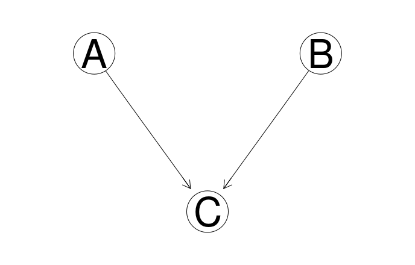

# Causal Inference Course: Homework 2
*Dan Saattrup Nielsen, August 2020*

This homework concerns building generative models, both Bayesian networks using `bnlearn` in `R`, and probabilistic programming using `pyro` in `Python`.

Our data is the survey data, containing the following categorical variables:

  - **Age (A)**: The age of the individual, which is *young* (**young**) if they'reless than 30 years old, *adult* (**adult**) if they're between 30 and 60 years old, and *old* (**old**) otherwise
  - **Sex (S)**: The biological sex of the individual, which here is assumed to be binary: *male* (**M**) or *female* (**F**)
  - **Education (E)**: The highest level of education completed by the individual, which can be *high school* (**high**) or *university degree* (**uni**)
  - **Occupation (O)**: Whether the individual is an *employee* (**emp**) or is *self employed* (**self**)
  - **Residence (R)**: The size of the city the individual lives in, which can be either *small* (**small**) or *big* (**big**)
  - **Travel (T)**: The means of transport favoured by the individual, recorded as *car* (**car**), *train* (**train**) or *other* (**other**)

Here travel is the target of the survey. We're using the following DAG as our model of the generative process of the data:


We start by defining this DAG in `bnlearn`:

```r
net <- bnlearn::model2network('[A][S][E|A:S][O|E][R|E][T|O:R]')
```

Next, we will collect every possible d-separation statement in our graph in the variable `arg_sets`:

```r
vars <- nodes(net)
pairs <- combn(x = vars, 2, list)
arg_sets <- list()
for(pair in pairs){
  others <- setdiff(vars, pair)
  conditioning_sets <- unlist(lapply(0:4, function(.x) combn(others, .x, list)), recursive = F)
  for(set in conditioning_sets){
    args <- list(x = pair[1], y = pair[2], z = set)
    arg_sets <- c(arg_sets, list(args))
  }
}
```

## Question 1: Markov Property

A distribution $P$ satisfies the **Markov property** with respect to a DAG $G$ if for disjoint node sets $A,B,C$ it holds that

$$ A\bot_G B|C \Rightarrow A\bot_P B|C. $$

### 1.1
To evaluate which of the potential d-separations are *actual* d-separations, we use `bnlearn`'s `dseparation` function. Here we store all the true d-separations in `dseps`:

```r
d_sep <- bnlearn::dseparation
dseps <- list()
for(args in arg_sets){
  if (d_sep(bn = net, x = args$x, y = args$y, z = args$z) == TRUE){
    dseps <- c(dseps, list(args))
  }
}
```

We can then check how many true d-separations there are:
```r
> length(dseps)
61
```

### 1.2
We say that a d-separation statement $X\bot_G Y|Z$ is **non-redundant** if $Z$ is minimal. As an example, for the nodes $A$ and $T$ in the DAG, $A\top T|E$ would be non-redundant (since $X$ and $Y$ aren't unconditionally independent of each other), but $A\bot_G T|O,R,S$ is redundant, as $A\bot_G T|O,R$ holds.

### 1.3
To list all the non-redundant d-separation statements, we do a simple check for each pair of nodes, to see if it's possible to remove a node from the conditioning set $Z$ and maintain conditional independence:

```r
dseps.nonredundant <- list()
for(args in dseps){
  nonredundant <- TRUE
  for(z in args$z){
    z.removed <- args$z[args$z != z]
    if(d_sep(bn = net, x = args$x, y = args$y, z = z.removed) == TRUE){
      nonredundant <- FALSE
      break
    }
  }
  if(nonredundant == TRUE){
    dseps.nonredundant <- c(dseps.nonredundant, list(args))
  }
}
```

We can now inspect `dseps.nonredundant` to see what the non-redundant d-separation statements in the graph are:

```
> dseps.nonredundant
[[1]]
[[1]]$x
[1] "A"

[[1]]$y
[1] "O"

[[1]]$z
[1] "E"


[[2]]
[[2]]$x
[1] "A"

[[2]]$y
[1] "R"

[[2]]$z
[1] "E"


[[3]]
[[3]]$x
[1] "A"

[[3]]$y
[1] "S"

[[3]]$z
character(0)


[[4]]
[[4]]$x
[1] "A"

[[4]]$y
[1] "T"

[[4]]$z
[1] "E"


[[5]]
[[5]]$x
[1] "A"

[[5]]$y
[1] "T"

[[5]]$z
[1] "O" "R"


[[6]]
[[6]]$x
[1] "E"

[[6]]$y
[1] "T"

[[6]]$z
[1] "O" "R"


[[7]]
[[7]]$x
[1] "O"

[[7]]$y
[1] "R"

[[7]]$z
[1] "E"


[[8]]
[[8]]$x
[1] "O"

[[8]]$y
[1] "S"

[[8]]$z
[1] "E"


[[9]]
[[9]]$x
[1] "R"

[[9]]$y
[1] "S"

[[9]]$z
[1] "E"


[[10]]
[[10]]$x
[1] "S"

[[10]]$y
[1] "T"

[[10]]$z
[1] "E"


[[11]]
[[11]]$x
[1] "S"

[[11]]$y
[1] "T"

[[11]]$z
[1] "O" "R"
```

Every one of the 11 d-separations should thus be read as $x\bot_G y | z$, so the last one for instance states that $S\bot_G T|O,R$, which can be seen by inspection to be non-redundant.

### 1.4
To make the search for d-separations more efficient, we can, for every pair of nodes, do a breadth-first search for the conditioning variables: first condition on one variable at a time, then pairs, and so on. As soon as we reach a conditional independence we know that the d-separation is non-redundant, and every set of conditioning variables containing that non-redundant set will also satisfy the d-separation statement, so there's no need to test them (via the `d_sep` function).

### 1.5
We now check how many of the true d-separations also satisfy conditional independence in our dataset. For every d-separation, we use `bnlearn`'s `ci.test` function to check this:

```r
dseps.ci <- list()
for(args in dseps){
  indep <- ci.test(x = args$x, y = args$y, z = args$z, data = df)
  if(indep$p.value > 0.05){
    dseps.ci <- c(dseps.ci, list(args))
  }
}
```

We can now check how large the proportion of true d-separations witness true conditional independence relations in the data:

```r
> length(setdiff(dseps, dseps.ci)) / length(dseps) 
[1] 0.9180328
```


### 1.6
We can also check how large the proportion of true *non-redundant* d-separations witness true conditional independence relations in the data:

```r
dseps.nonredundant.ci <- list()
for(args in dseps.nonredundant){
  indep <- ci.test(x = args$x, y = args$y, z = args$z, data = df)
  if(indep$p.value > 0.05){
    dseps.nonredundant.ci <- c(dseps.nonredundant.ci, list(args))
  }
}
```

```r
> length(dseps.nonredundant.ci) / length(dseps.nonredundant)
[1] 1
```

### 1.7
Based on the results in 1.5 and 1.6, the Markov property holds for this DAG and dataset. 

It is a bit strange that there are d-separations which are true conditional independencies but which stop reflecting true conditional independencies after we condition on further variables (and maintain the d-separation, so no collider bias is happening). These are the five culprits:

```r
> setdiff(dseps, dseps.ci)
[[1]]
[[1]]$x
[1] "A"

[[1]]$y
[1] "O"

[[1]]$z
[1] "E" "S"


[[2]]
[[2]]$x
[1] "A"

[[2]]$y
[1] "R"

[[2]]$z
[1] "E" "O"


[[3]]
[[3]]$x
[1] "O"

[[3]]$y
[1] "S"

[[3]]$z
[1] "A" "E"


[[4]]
[[4]]$x
[1] "O"

[[4]]$y
[1] "S"

[[4]]$z
[1] "E" "T"


[[5]]
[[5]]$x
[1] "S"

[[5]]$y
[1] "T"

[[5]]$z
[1] "E" "O"
```


## Question 2: Faithfulness
A distribution $P$ is **faithful** with respect to a DAG $G$ if for disjoint node sets $A,B,C$ it holds that

$$ A\bot_P B|C \Rightarrow A\bot_G B|C. $$

In other words, it's the dual version of the Markov property.

### 2.1
Analogous to what we did in Question 1, we now make a list `cis` containing all the true conditional independence relations in our dataset:

```r
cis <- list()
for(args in dseps){
  indep <- ci.test(x = args$x, y = args$y, z = args$z, data = df)
  if(indep$p.value > 0.05){
    cis <- c(cis, list(args))
  }
}
```

As before, we can count how many conditional indepdence relations there are:

```r
> length(cis)
[1] 56
```

### 2.2
We now check how many true conditional independence relations reflect true d-separations in the DAG, as before. We start by storing them in `cis.dsep`:

```r
cis.dsep <- list()
for(args in cis){
  if(d_sep(bn = net, x = args$x, y = args$y, z = args$z) == TRUE){
    cis.dsep <- c(cis.dsep, list(args))
  }
}
```

Next, we compute the proportion:
```r
> length(cis.dsep) / length(cis)
[1] 1
```

### 2.3
If we were to check whether the true conditional independence relations were not only true d-separations, but *non-redundant* d-separations, we see that, non-surprisingly, the proportion is a lot smaller:

```r
> length(intersect(cis.dsep, dseps.nonredundant)) / length(cis.dsep)
[1] 0.1964286
```

### 2.4
From the result in 2.2, I would conclude that the faithfulness assumption holds for this DAG and dataset. There's no reason to believe that every conditional independence relation corresponds to a non-redundant d-separation, as there are plenty of redundant conditional independence relations as well.

## Question 3: Intervention as Graph Mutilation
We now build a new DAG that we will be working with:

```r
net <- model2network('[A][B|A][C|B:A]')
alias <- c('off', 'on')
cptA <- matrix(c(0.5, 0.5), ncol=2)
dimnames(cptA) <- list(NULL, alias)
cptB <- matrix(c(.8, .2, .1, .9), ncol=2)
dimnames(cptB) <- list(B = alias, A = alias)
cptC <- matrix(c(.9, .1, .99, .01, .1, .9, .4, .6))
dim(cptC) <- c(2, 2, 2)
dimnames(cptC) <- list(C = alias, A = alias, B = alias)
model <- custom.fit(net, list(A = cptA, B = cptB, C = cptC))
graphviz.plot(model)
```


### 3.1
We now calculate the following conditional probability, using (the conditional version of) Bayes' Rule:

\begin{align}
  &P(A = \text{on} | B = \text{on}, C = \text{on}) \\
  &= \frac{P(C = \text{on} | B = \text{on}, A = \text{on})P(A = \text{on} | B = \text{on})}{P(C = \text{on} | B = \text{on})} \\
  &= \frac{P(C = \text{on} | B = \text{on}, A = \text{on})P(A = \text{on} | B = \text{on})}{P(C = \text{on} | B = \text{on}, A = \text{on})P(A = \text{on} | B = \text{on}) + P(C = \text{on} | B = \text{on}, A = \text{off})P(A = \text{off} | B = \text{on})}
\end{align}

We start by calculating $P(A = \text{on} | B = \text{on})$, using Bayes' Rule again:

\begin{align}
  &P(A = \text{on} | B = \text{on}) \\
  &= \frac{P(B = \text{on} | A = \text{on})P(A = \text{on})}{P(B = \text{on})} \\
  &= \frac{P(B = \text{on} | A = \text{on})P(A = \text{on})}{P(B = \text{on} | A = \text{on})P(A = \text{on}) + P(B = \text{on} | A = \text{off})P(A = \text{off})} \\
  &= \frac{0.9\cdot 0.5}{0.9\cdot 0.5 + 0.2\cdot 0.5} \\
  &\approx 0.82
\end{align}

From this we calculate the desired conditional probability:

\begin{align}
  &P(A = \text{on} | B = \text{on}, C = \text{on}) \\
  &= \frac{P(C = \text{on} | B = \text{on}, A = \text{on})P(A = \text{on} | B = \text{on})}{P(C = \text{on} | B = \text{on}, A = \text{on})P(A = \text{on} | B = \text{on}) + P(C = \text{on} | B = \text{on}, A = \text{off})P(A = \text{off} | B = \text{on})} \\
  &\approx \frac{0.6\cdot 0.82}{0.6\cdot 0.82 + 0.9\cdot (1 - 0.82)} \\
  &\approx 0.75
\end{align}

### 3.2
We can estimate the above conditional probability by sampling the model, using the `rbn` function in `bnlearn`:

```r
> rbns <- bnlearn::rbn(model, n = 100000) %>%
>         dplyr::filter(B == 'on', C == 'on')
> nrow(rbns %>% dplyr::filter(A == 'on')) / nrow(rbns)
[1] 0.749493
```

### 3.3
Rather than working with conditional probabilities, we now turn to interventions. We can use `bnlearn`'s `mutilated` function to perform the intervention $\text{do}(B = \text{on})$:

```r
net.mutilated <- bnlearn::mutilated(net, list(B='on'))
graphviz.plot(net.mutilated)
```



### 3.4
We now calculate the following intervention, analogous to its conditional probability statement from 3.1. We start by applying the conditional Bayes' Rule as before:

\begin{align}
  &P(A = \text{on} | \text{do}(B = \text{on}), C = \text{on}) \\
  &= \frac{P(C = \text{on} | \text{do}(B = \text{on}), A = \text{on})P(A = \text{on} | \text{do}(B = \text{on}))}{P(C = \text{on} | \text{do}(B = \text{on}))} \\
  &= \frac{P(C = \text{on} | \text{do}(B = \text{on}), A = \text{on})P(A = \text{on} | \text{do}(B = \text{on}))}{P(C = \text{on} | \text{do}(B = \text{on}), A = \text{on})P(A = \text{on}) + P(C = \text{on} | \text{do}(B = \text{on}), A = \text{off})P(A = \text{off})}
\end{align}

We now need to change the expression into one without any do-statements.

  - The third rule of do-calculus (deletion of actions) allows us to conclude that $P(A = \text{on} | \text{do}(B = \text{on}))$ is equal to $P(A = \text{on})$, which is applicable since $A$ is d-separated by $B$ in the mutilated graph in which all ingoing edges to $B$ have been removed.
  - The second rule of do-calculus (action/observation exchange) gives us that we can exchange the do-expression in $P(C = \text{on} | \text{do}(B = \text{on}), A = \text{on})$ with its conditional counterpart; the same thing is the case where $A = \text{off}$.

These two lemmata then gives us the following:

\begin{align}
  &P(A = \text{on} | \text{do}(B = \text{on}), C = \text{on}) \\
  &= \frac{P(C = \text{on} | B = \text{on}, A = \text{on})P(A = \text{on})}{P(C = \text{on} | B = \text{on}, A = \text{on})P(A = \text{on}) + P(C = \text{on} | B = \text{on}, A = \text{off})P(A = \text{off})} \\
  &= \frac{0.6\cdot 0.5}{0.6\cdot 0.5 + 0.9\cdot 0.5} \\
  &= 0.4
\end{align}

### 3.5
As in 3.2, we can also estimate the probability from 3.4 by sampling the model:

```r
> model.mutilated <- bnlearn::mutilated(model, list(B='on'))
> rbns.mutilated <- bnlearn::rbn(model.mutilated, n = 100000) %>%
                    dplyr::filter(C == 'on')
> nrow(rbns.mutilated %>% dplyr::filter(A == 'on')) / nrow(rbns.mutilated)
[1] 0.400608
```

We see that this is in agreement with the analytical result from 3.4.

## Question 4: Implement Intervention in Pyro

### 4.1
We can implement the model from Question 3 in Pyro as follows:

```python
def intervention():

    prob_A = torch.tensor([
        .50, # P(A = 'on')
        .50 # P(A = 'off')
    ])

    prob_B = torch.tensor([
        [
            .90, # P(B = 'on' | A = 'on')
            .10  # P(B = 'off' | A = 'on')
        ],
        [
            .20, # P(B = 'on' | A = 'off')
            .80  # P(B = 'off' | A = 'off')
        ]
    ])

    prob_C = torch.tensor([
        [
            [
                .60, # P(C = 'on' | A = 'on', B = 'on')
                .40  # P(C = 'off' | A = 'on', B = 'on')
            ],
            [
                .01, # P(C = 'on' | A = 'on', B = 'off')
                .99  # P(C = 'off' | A = 'on', B = 'off')
            ]
        ],
        [
            [
                .90, # P(C = 'on' | A = 'off', B = 'on')
                .10  # P(C = 'off' | A = 'off', B = 'on')
            ],
            [
                .10, # P(C = 'on' | A = 'off', B = 'off')
                .90  # P(C = 'off' | A = 'off', B = 'off')
            ]
        ]
    ])

    A = pyro.sample('A', dist.Categorical(probs = prob_A))
    B = pyro.sample('B', dist.Categorical(probs = prob_B[A]))
    C = pyro.sample('C', dist.Categorical(probs = prob_C[A][B]))

    return C
```

### 4.2
We now compute the conditional probability $P(A = \text{on} | B = \text{on}, C = \text{on})$ from 3.1 and 3.2, using Pyro:

```python
# Create the conditional distribution
conditioned = pyro.condition(
    intervention, 
    {'B': torch.tensor(0), 'C': torch.tensor(0)}
)

# Estimate the joint distribution with the Importance Sampling algorithm
posterior = pyro.infer.Importance(conditioned, num_samples = 10000).run()

# Get the marginal distribution from A
marginal = pyro.infer.EmpiricalMarginal(posterior, 'A')

# Generate samples from the marginal distribution and record how many
# of them are 'on'
samples = [marginal() for _ in range(10000)]
ons = [sample for sample in samples if sample == torch.tensor(0)]
```

From `samples` and `ons` we can then find the conditional probability:

```python
>>> len(ons) / len(samples)
0.742
```

### 4.3
Lastly, we use Pyro to also compute the interventional distribution $P(A = \text{on} | \text{do}(B = \text{on}), C = \text{on})$:

```python
# Intervene on B
intervened = pyro.do(
    intervention,
    {'B': torch.tensor(0)}
)

# Condition on C
conditioned = pyro.condition(
    intervened, 
    {'C': torch.tensor(0)}
)

# Estimate the joint distribution with the Importance Sampling algorithm
posterior = pyro.infer.Importance(conditioned, num_samples = 10000).run()

# Get the marginal distribution from A
marginal = pyro.infer.EmpiricalMarginal(posterior, 'A')

# Generate samples from the marginal distribution and record how many
# of them are 'on'
samples = [marginal() for _ in range(10000)]
ons = [sample for sample in samples if sample == torch.tensor(0)]
```

From `samples` and `ons` we can then find the conditional probability:

```python
>>> len(ons) / len(samples)
0.4051
```

